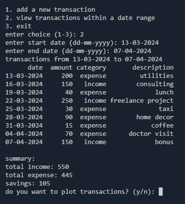
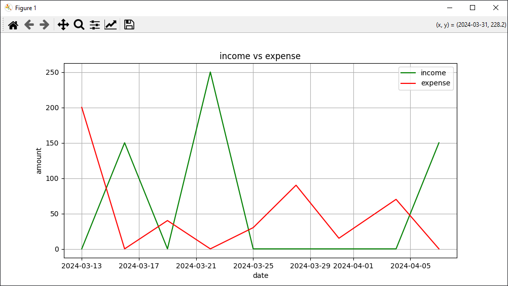

# Finance tracker

A basic finance tracker where you can track your income and expenses. download the source code from the github release and run the `main.py` file and use the cli to navigate the menu and choose your option. transactions during a specific timeframe can also be plotted on a graph using the view transactions option.

